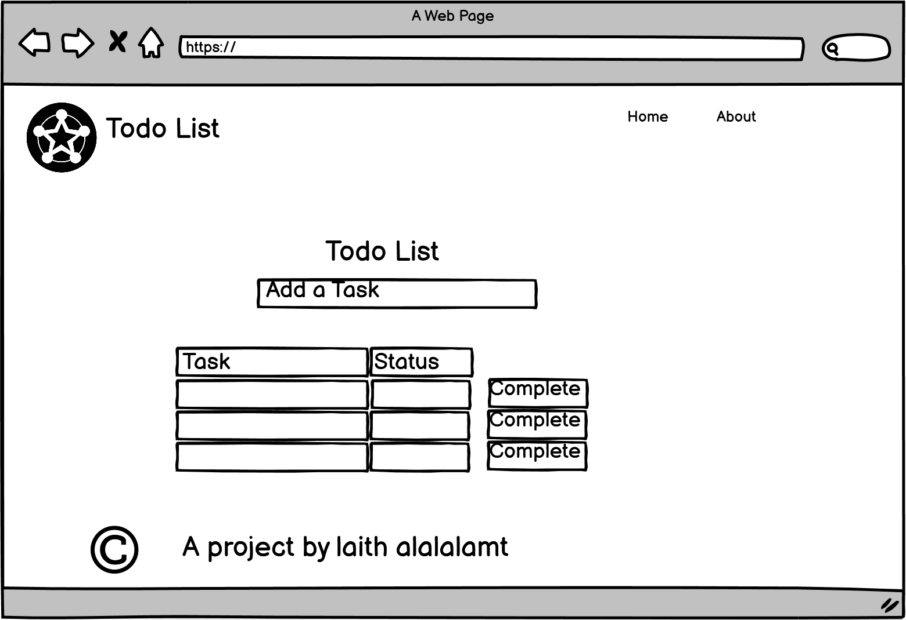
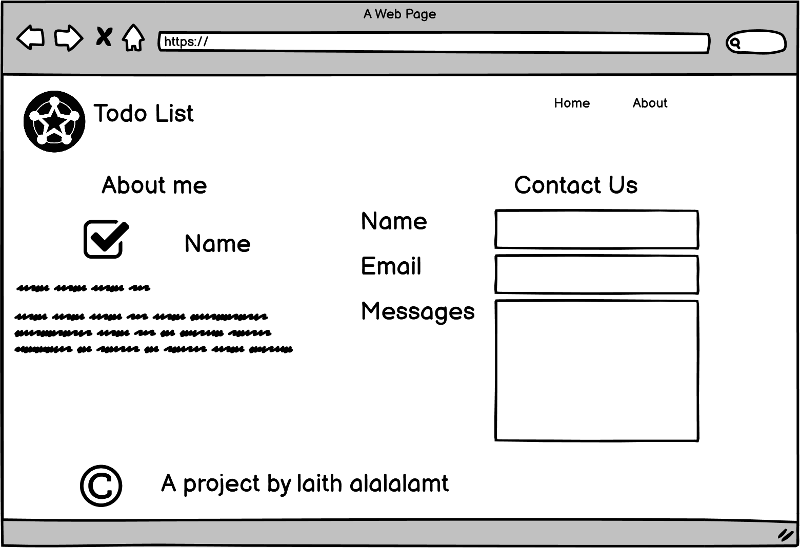

# todo-project

## **Task4**
### What observations or questions do you have about what you’ve learned so far?

#### Answer: everything is clear and there is no question, practice makes perfect! 

### How long did it take you to complete this assignment? And, before you started, how long did you think it would take you to complete this assignment?

#### Answer: About three hours, about the same time I thought it would take me.

## **Task5**
### What observations or questions do you have about what you’ve learned so far?

#### Answer: everything is clear and there is no question, practice makes perfect! 

### How long did it take you to complete this assignment? And, before you started, how long did you think it would take you to complete this assignment?

#### Answer: About two hours, about the same time I thought it would take me.